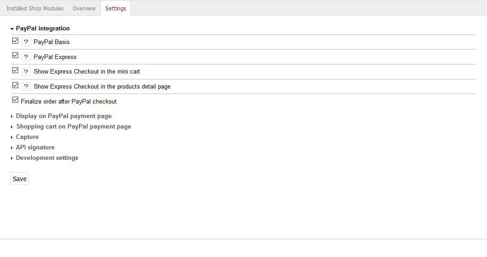

Configuration
=============

In order to enable PayPal payment for customers in the OXID eShop, the related payment type needs to be configured. In the module settings, you can define how payment via PayPal is to be made in the OXID eShop.

Setting up PayPal payment method
--------------------------------
You can configure the payment method according to your needs. Detailed information can be found in the OXID eShop user documentation: `Payment methods <https://docs.oxid-esales.com/eshop/en/6.1/setup/payment-methods/index.html>`_. Change if necessary the :guilabel:`Purchase Price (€)` to 0 in the :guilabel:`from` field and 10000 in the :guilabel:`to` field.

With a standard installation of the shop, PayPal can be set up in only two steps.

* Under :menuselection:`Shop Settings --> Payment Methods`, at least the user group "Domestic customer" is assigned to PayPal payment.
* Under :menuselection:`Shop Settings --> Shipping Methods`, PayPal payment is assigned to the respective shipping methods, for example Standard.

Please define a standard shipping method for payments via PayPal. This shipping method is required and used for customer orders placed via a mobile device. You can find the corresponding option on the :guilabel:`Main` tab of Shipping Methods.

Module settings
---------------
Go to :menuselection:`Extensions --> Modules` in the admin panel of the shop and select the PayPal module. In the :guilabel:`Settings` tab, the module can be configured. Help texts are available for the individual settings.

PayPal integration
^^^^^^^^^^^^^^^^^^
In this section you can find several settings for integrating the PayPal payment into the OXID eShop. With PayPal Basis activated, the PayPal payment method will be offered at the end of the checkout process. If the customer selects this payment method, he confirms the purchase on the PayPal payment page and will be subsequently redirected to the shop. PayPal Express allows the customer to go directly to the PayPal payment page in the first step of the checkout flow. There, the buyer confirms the purchase and will then be redirected to the shop. The shop receives all customer information relevant for the purchase from PayPal. The PayPal Express button can also be enabled for the mini cart and the product details page.

Display on PayPal payment page
^^^^^^^^^^^^^^^^^^^^^^^^^^^^^^
Enter here the name of the shop to appear on the PayPal payment page. By entering the hexadecimal code, you can define the cart area gradient color on the PayPal payment page. It is set according to the RRGGBB model. Example: For the cart area color "darkblue", enter 000088. Information on the hexadecimal color code can be found at a page of the free encyclopedia Wikipedia: `Web colors <http://en.wikipedia.org/wiki/Hexadecimal_color>`_.

Another setting allows the display of the shop logo instead of its name on the PayPal payment page. The image should have a maximum size of 190x60 px (width x height) and be located in the :file:`/out/{theme}/img` folder. For each theme used, the relevant file has to be in the corresponding folder.

The shop logo can be the standard logo used for the shop. It is defined in the :file:`config.inc.php` configuration file by the "sShopLogo" parameter. However, you may also have a custom shop logo displayed on the PayPal payment page, the file name of which is to be entered here.

Shopping cart on PayPal payment page
^^^^^^^^^^^^^^^^^^^^^^^^^^^^^^^^^^^^
Items in the shopping cart can be viewed on the PayPal payment page including product name, number and price. This is a basic setting, which the customer, however, needs to confirm at checkout. Further, it can be set whether the customer has to check this option or the view of the shopping cart on the PayPal payment page shall be activated by default. We recommend to have the shopping cart transferred to the PayPal payment page and to set the option that customer's confirmation is enabled by default.

Capture
^^^^^^^
Basically, there are two ways to set the time for capture. PayPal can either process the capture from the customer's account immediately at purchase (SALE) or verify the customer's account at purchase and authorize the transaction (AUTH). Within a period of 29 days, the shop operator can manually capture the reserved amount, e.g. before shipping the goods. Only ship goods when the PayPal status says "Completed".

Furthermore, the OXID eShop can select the time for the money transfer automatically (AUTOMATIC). This option is based on the stock of the ordered products and a defined remaining stock. After an order is placed, the stock of a product is checked whether it falls below the defined remaining stock. In this case, AUTH is selected for money transfer. Otherwise, SALE is set.

API signature
^^^^^^^^^^^^^
In order to use PayPal as payment method in the OXID eShop, an API signature is required. It will be granted by PayPal. Login to your PayPal Business account and request the API signature in your profile. After accepting the PayPal User Agreement, you will receive your API username and password as well as a signature. Enter this information here and add the e-mail address used for PayPal.

Development settings
^^^^^^^^^^^^^^^^^^^^
The PayPal Sandbox allows intensive testing of the PayPal payment when building the online shop. It provides a test environment within which transactions via PayPal are simulated. No real payments are triggered. Detailed information can be found in the documentation for PayPal developers: `PayPal Sandbox Testing Guide <https://developer.paypal.com/docs/classic/lifecycle/ug_sandbox/>`_.

In case of problems, PayPal logging can be activated for extensive troubleshooting.

.. Intern: oxdaac, Status: