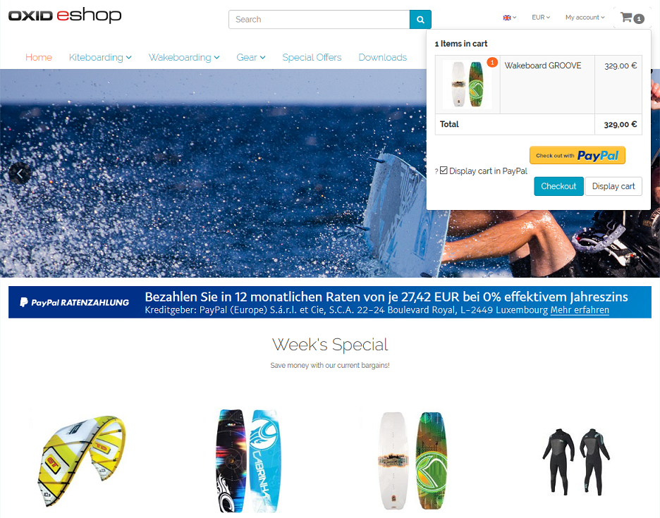

Functional description
======================

In the OXID eShop, orders can be paid via PayPal. With PayPal Basis the payment method PayPal is available in the shop and can be selected in order step 3. If PayPal Express and Express Checkout have been activated, the customer can complete the purchase from order step 1, from order step 2 if not already logged in, from a product details page or from the mini cart. Payment by installments is an offer from PayPal, which can be displayed to the customer in the shop. The installment banners can be shown on the start page, the details page of products, the category pages, in the search results and/or in the order process.

During the order process, the shop will direct the user to the PayPal payment page, where he/she must log in. Depending on the configuration and the customer's decision, the products of the order are displayed there.

.. Intern: oxdaad, Status: transL