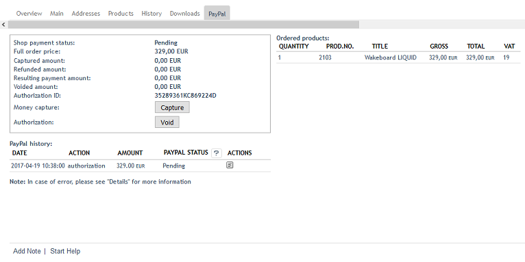

PayPal for orders
=================

If products have been paid via PayPal, payment information, a PayPal history and an overview of the ordered products will be shown on the :guilabel:`PayPal` tab of the order in the admin panel.

The payment information shows the payment status, the total amount of the order and amounts that were captured, canceled or refunded.

In case of delayed capture of an order amount (AUTH), up to 10 captures can be made within a period of 29 days. This allows you to react flexibly if, for example, only parts of an order can be fulfilled at a given time. In this case, we recommend capturing the first partial deliver immediately after the order is completed and authorization is made. Then wait until all remaining items of the order are available for shipment and capture the remaining amount.

With a click on the :guilabel:`Capture` button, the total amount or partial amounts can be captured from the customer account. This process can be documented by a comment.

A granted authorization for capture can be canceled and a payment status can be set. The payment status can be "Completed", "Pending" or "Canceled". Also here it is possible to document, for example, the reason for the cancellation by a comment.

In the :guilabel:`PayPal history`, all transactions are shown in a summarize table. For each transaction such as authorization, capture, refund or cancellation, a line is created in the table at the end of which further details can be viewed by clicking on a small button. The table lines for the capture of an amount have another button for refunds. Thus, the refund can be assigned exactly to an amount captured.

An additional table on the tab gives an overview of all ordered products including quantity, product number, product name, price and VAT.

.. Intern: oxdaaf, Status: