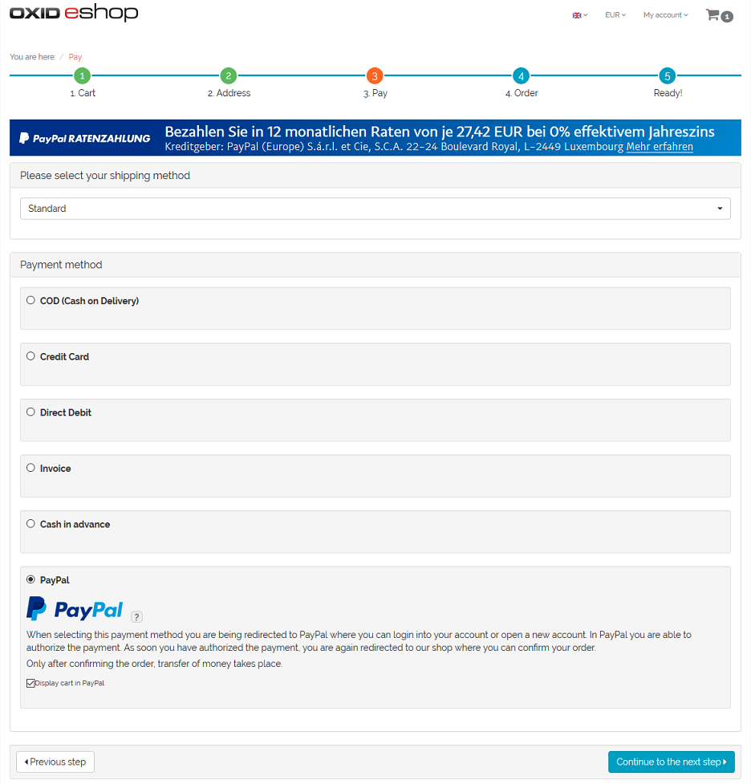
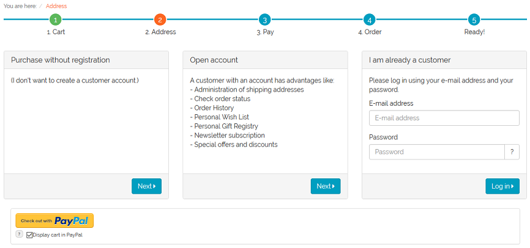
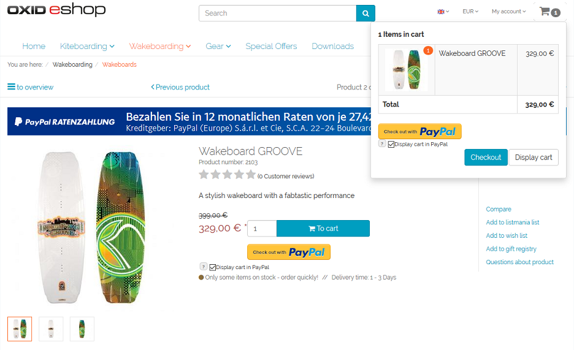
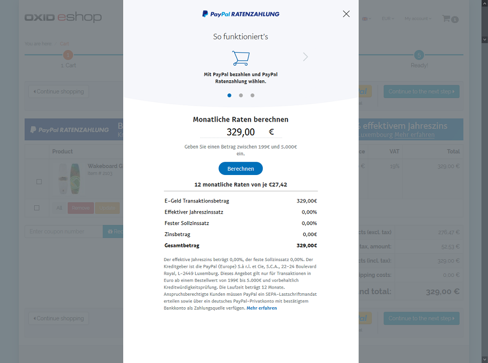

PayPal in the checkout process
==============================

With PayPal Basis, PayPal can be selected as payment method during checkout step 3. At this time, the user is already logged in to the shop or shopping without registration.

When checking out with PayPal Express, the buyer can complete the purchase from checkout step 1, from checkout step 2 if not yet logged in, the product details page or the mini cart.

|br|

|br|

|br|
In both cases, the user will be directed to the PayPal payment page. According to the configuration and customer's approval, the ordered products are shown on the PayPal payment page.

.. hint:: If there are products with a fraction of a quantity (e.g. 1,5) in the shopping cart, the shopping cart will not be submitted to PayPal, no matter if the purchaser activated this option during the checkout.

The customer can now login to his PayPal account or create a new account. After payment confirmation, the customer is redirected to the shop.

In case of express order, also the customer's information from the PayPal account is provided to the shop. Thus, the form in checkout step 2 does not need to be filled out. Since also the shipping method can be selected on the PayPal payment page, the checkout process jumps directly to step 4.

After checkout is completed, the payment is arranged. Depending on the configuration, the amount is either transferred immediately between the PayPal accounts or the payment is authorized. The authorized amount will be captured manually at a later time.

.. Intern: oxdaae, Status: transL