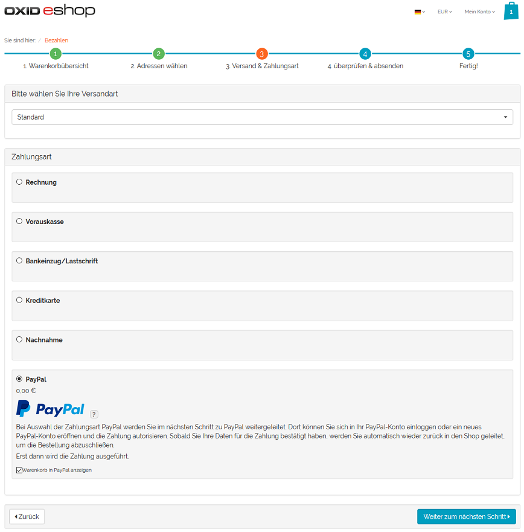
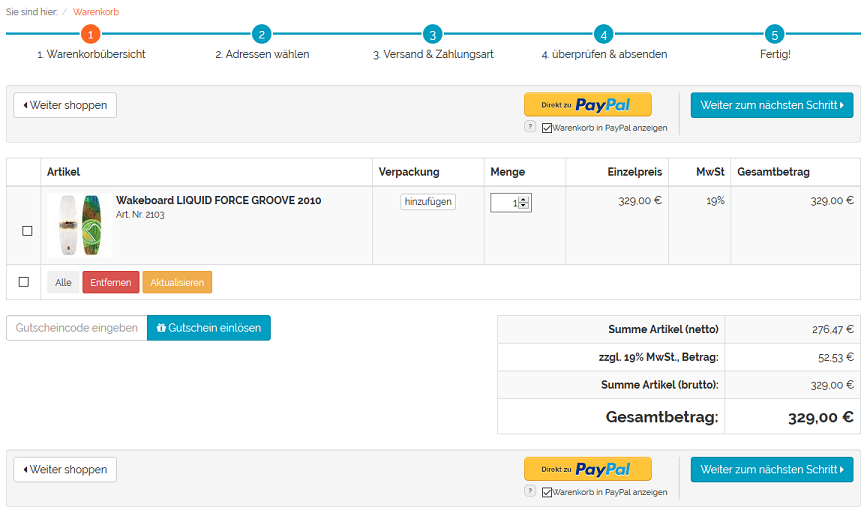
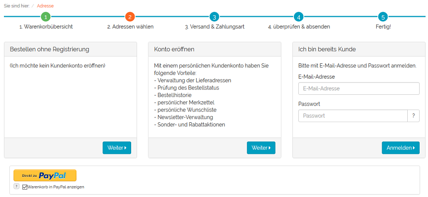
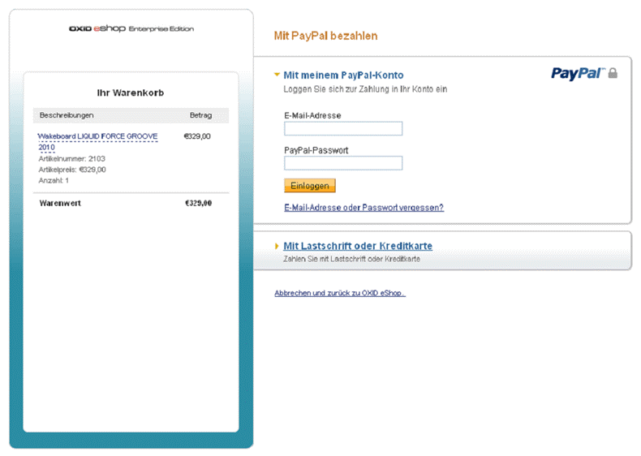

Funktionsbeschreibung
=====================

Bestellungen können im OXID eShop mit PayPal bezahlt werden.

PayPal im Bestellprozess
------------------------
Mit PayPal Basis lässt sich die Zahlungsart PayPal im Bestellschritt 3 auswählen. Der Benutzer ist zu diesem Zeitpunkt bereits im Shop angemeldet oder kauft ohne Registrierung ein. In beiden Fällen hat er seine Adressdaten bereits eingegeben, wenn er zur PayPal-Zahlungsseite gelangt.

Bei Bestellung mit PayPal Express kann der Kunde aus dem Bestellschritt 1, aus dem Bestellschritt 2 sofern noch nicht angemeldet, aus einer Artikel-Detailseite oder aus dem Mini-Warenkorb heraus den Einkauf abschließen.

|br|

|br|

.. image:: media/screenshots-de/oxdaad04.png
    :alt: Artikel-Detailseite mit Mini-Warenkorb
    :class: with-shadow
    :height: 350
    :width: 650

|br|
Der Shop leitet den Benutzer jeweils zur PayPal-Zahlungsseite. Je nach Konfiguration und Kundenentscheidung werden die Artikel der Bestellung auf der PayPal-Zahlungsseite angezeigt.

.. hint::  Befinden Sich Artikel in nicht ganzzahliger Menge (z.B. 1,5) im Warenkorb, wird der Warenkorb niemals in PayPal angezeigt, auch wenn diese Option im Bestellprozess aktiviert wurde.

Der Kunde kann sich nun an sein PayPal-Konto anmelden oder ein neues erstellen. Nach Bestätigung der Zahlung wird der Kunde zurück zum Shop geleitet. Im Falle des Express-Kaufs werden dabei auch die Kundendaten aus dem PayPal-Konto an den Shop übergeben. Damit entfällt das Ausfüllen des Formulars im Bestellschritt 2. Da auch die Versandart auf der PayPal-Zahlungsseite gewählt werden kann, wird direkt Bestellschritt 4 aufgerufen.

Nach Abschluss der Bestellung findet die Bezahlung statt. Abhängig von der Konfiguration wird der Betrag zwischen den PayPal-Konten sofort gebucht oder es erfolgt eine Autorisierung der Zahlung. Der autorisierte Betrag wird zu einem späteren Zeitpunkt manuell eingezogen.

--------------------------------------------------

PayPal bei der Bestellung
-------------------------
Wurden die Artikel mit PayPal bezahlt, werden im Administrationsbereich auf der Registerkarte PayPal der Bestellung Zahlungsinformationen, eine PayPal-Historie und eine Übersicht der bestellten Artikel angezeigt.

.. image:: media/screenshots-de/oxdaad06.png
    :alt: Bestellungen, Registerkarte "PayPal"
    :class: with-shadow
    :height: 320
    :width: 650

Die Zahlungsinformationen zeigen den Zahlungsstatus, den gesamten Bestellpreis und Beträge, die eingezogen, storniert oder erstattet wurden.

Ist die Bestellung mit dem zeitverzögerten Einziehen des Betrages (AUTH) verbunden, können bis zu 10 Einzeleinzüge innerhalb von 29 Tagen durchgeführt werden. Somit können Sie flexibel reagieren, wenn beispielsweise zunächst nur Teile der Bestellung geliefert werden können. Wir empfehlen in diesem Fall unmittelbar nach Abschluss der Bestellung und erfolgter Autorisierung einen Einzug auf die erste Teillieferung. Warten Sie dann, bis alle übrigen Artikel der Bestellung lieferbereit sind und ziehen Sie den restlichen Betrag ein.

Mit der Schaltfläche :guilabel:`Einziehen` lassen sich der gesamte Betrag oder Teilbeträge vom Kundenkonto einziehen. Der Vorgang kann mit einem Kommentar dokumentiert werden.

Eine erteilte Autorisierung zum Geldeinzug kann storniert und ein Zahlungsstatus gesetzt werden. Der Zahlungsstatus kann "Abgeschlossen", "Ausstehend" oder "Abgebrochen" sein. Auch hier ist es möglich, beispielsweise den Grund der Stornierung in einem Kommentar festzuhalten.

In der :guilabel:`PayPal-Historie` werden alle Transaktionen in einer tabellarischen Übersicht angezeigt. Für jede Transaktion, wie Autorisierung, Einzug, Erstattung oder Stornierung, wird eine Tabellenzeile angelegt, an deren Ende über eine kleine Schaltfläche Details aufgerufen werden können. Die Tabellenzeilen für den Einzug eines Betrages haben eine weitere Schaltfläche, um Erstattungen vornehmen zu können. Somit ist eine genaue Zuordnung der Erstattung zu einem eingezogenen Betrag möglich.

Eine weitere tabellarische Übersicht auf der Registerkarte listet alle bestellten Artikel mit Anzahl, Artikel-nummer, Titel, Preis und Mehrwertsteuer auf.

.. Intern: oxdaad, Status: