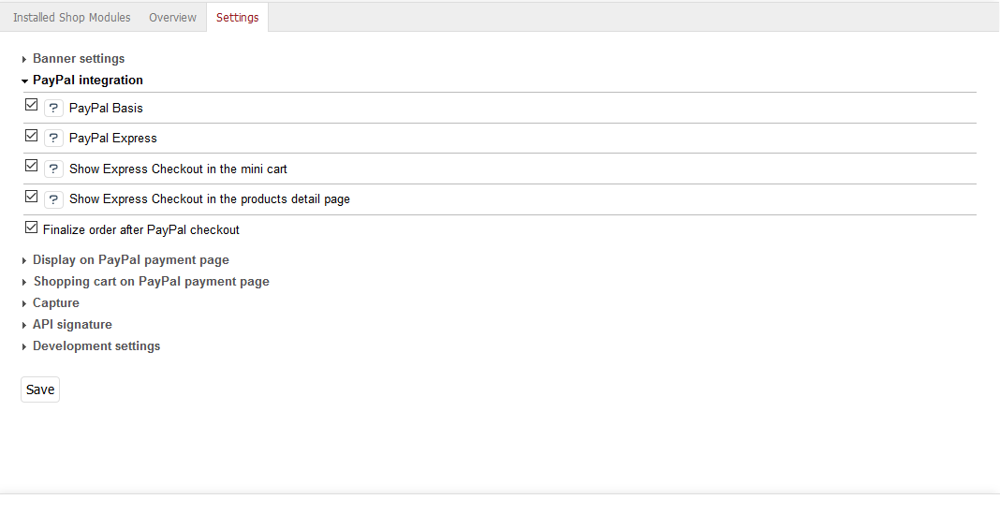

Konfiguration
=============

Damit Kunden im OXID eShop mit PayPal bezahlen können, muss die zugehörige Zahlungsart konfiguriert werden. In den Einstellungen des Moduls wird festgelegt, wie die Bezahlung mit PayPal im OXID eShop funktionieren soll.

Zahlungsart PayPal einrichten
-----------------------------
Konfigurieren Sie die Zahlungsart nach Ihren Wünschen. Detaillierte Informationen finden Sie im Abschnitt `Zahlungsarten <https://docs.oxid-esales.com/eshop/de/6.0/einrichtung/zahlungsarten/zahlungsarten.html>`_ der Anwenderdokumentation des OXID eShop. Ändern Sie bitte ggf. den Einkaufswert (€) in 0 bis 99999.

In einer Standardinstallation des Shops kann PayPal in nur zwei Schritten eingerichtet werden:

* Unter :menuselection:`Shopeinstellungen --> Zahlungsarten` wird mindestens die Benutzergruppe Inlandskunde der Zahlungsart PayPal zugewiesen.
* Unter :menuselection:`Shopeinstellungen --> Versandarten` wird die Zahlungsart PayPal den jeweiligen Versandarten, zum Beispiel Standard, zugewiesen.

Definieren Sie bitte eine Versandart als Standard für die Bezahlung mit PayPal. Diese Versandart wird benötigt und verwendet, wenn Kunden mit einem mobilen Endgerät in Ihrem Shop bestellen. Die entsprechende Option finden Sie auf der Registerkarte :guilabel:`Stamm` der Versandarten.

Moduleinstellungen
------------------
Gehen Sie im Administrationsbereich des Shops zu :menuselection:`Erweiterungen --> Module` und wählen Sie das Modul PayPal aus. Auf der Registerkarte :guilabel:`Einstell.` kann das Modul konfiguriert werden. Zu den einzelnen Einstellungen lassen sich Hilfetexte aufrufen.

Banner-Einstellungen
^^^^^^^^^^^^^^^^^^^^
Im Shop können auf der Startseite, der Detailseite von Artikeln, den Kategorieseiten, in den Suchergebnissen und/oder im Bestellprozess Banner eingeblendet werden, die auf die von PayPal angebotenen Ratenzahlung hinweisen. Grundlage der Kommunikation zwischen dem Shop und PayPal ist die so genannte Client-ID, ein alphanumerischer Wert. Dieser ist im PayPal-Konto des Shopbetreibers unter Payer ID oder auch Merchant ID abrufbar und muss in den Moduleinstellungen gespeichert werden. Wurde das Kontrollkästchen :guilabel:`Ratenzahlung-Banner nicht anzeigen` aktiviert, werden die Einstellungen für einzelne Banner ignoriert und die Anzeige der Banner wird komplett unterbunden.

Die Banner können für die jeweiligen Bereiche des Shop-Frontends aktiviert werden. Ihre konkrete Position im für die Ausgabe zuständigen Template wird durch CSS-Selektoren angegeben. Damit können die Banner auch in einem eigenen oder modifizierten Theme verwendet werden. Die Hintergrundfarbe der Banner für die Ratenzahlung kann weiß, blau oder schwarz sein.

Integration von PayPal
^^^^^^^^^^^^^^^^^^^^^^
In diesem Bereich finden Sie einige Einstellungen, wie das Bezahlen mit PayPal in den OXID eShop integriert wird. Mit PayPal Basis wird PayPal am Ende des Bestellprozesses als Zahlungsart angeboten. Wählt der Kunde diese Zahlungsart, bestätigt er auf der PayPal-Zahlungsseite den Kauf und wird anschließend in den Shop zurückgeleitet. PayPal Express bietet die Möglichkeit, dass der Kunde schon im ersten Bestellschritt direkt zur PayPal-Zahlungsseite wechseln kann. Dort bestätigt er den Kauf und gelangt wieder in den Shop zurück. Der Shop übernimmt dabei die für den Kauf relevanten Kundendaten. Auch für den Mini-Warenkorb und die Artikel-Detailseite kann die Schaltfläche für PayPal Express aktiviert werden.

Anzeige auf PayPal-Zahlungsseite
^^^^^^^^^^^^^^^^^^^^^^^^^^^^^^^^
Geben Sie hier den Namen des Shops an, der auf der PayPal-Zahlungsseite angezeigt werden soll. Eine weitere Einstellung ermöglicht es, ein Logo des Shops anstatt des Namens auf der PayPal-Zahlungsseite anzuzeigen. Die Grafik dafür sollte eine maximale Größe (Breite*Höhe) von 190px*60px haben und im Verzeichnis :file:`/out/{theme}/img` gespeichert sein. Für jedes verwendete Theme muss die Datei im jeweiligen Verzeichnis existieren. Das Shop-Logo kann das standardmäßig im Shop verwendete sein. Dieses wird mit dem Parameter "sShopLogo" in der Konfigurationsdatei :file:`config.inc.php` definiert. Es kann aber auch ein spezielles Shop-Logo auf der PayPal-Zahlungsseite angezeigt werden, dessen Dateiname hier angegeben wird.

Warenkorb auf PayPal-Zahlungsseite
^^^^^^^^^^^^^^^^^^^^^^^^^^^^^^^^^^
Artikel, die sich im Warenkorb befinden, lassen sich auf der PayPal-Zahlungsseite mit Titel, Artikelnummer und Artikelpreis anzeigen. Dies ist eine generelle Einstellung, welcher der Kunde jedoch bei der Bestellung zustimmen muss. Ob er dabei explizit ein Häkchen setzen muss oder ob die Option zur Anzeige des Warenkorbs auf der PayPal-Zahlungsseite bereits aktiviert ist, kann ebenfalls festgelegt werden. Wir empfehlen, dass der Warenkorb zu PayPal zu übertragen wird und die Option zur Zustimmung des Kunden standardmäßig aktiviert ist.

Geldeinzug
^^^^^^^^^^
Für den Zeitpunkt, zu dem das Geld eingezogen wird, gibt es grundsätzlich zwei Methoden. PayPal kann den Betrag zum einen sofort beim Kauf vom Kundenkonto einziehen (SALE). Zum anderen wird das Kundenkonto bei Kauf geprüft und die Zahlung wird autorisiert (AUTH). Der Shopbetreiber kann innerhalb von 29 Tagen, beispielsweise vor Versand der Ware, den reservierten Betrag manuell einziehen. Versenden Sie die Ware immer erst dann, wenn der PayPal-Status "Completed" ist.

Der OXID eShop kann darüber hinaus den Zeitpunkt des Geldtransfers automatisch wählen (AUTOMATIC). Grundlage dafür ist der Lagerbestand der bestellten Artikel und ein definierter Restlagerbestand. Es wird geprüft, ob nach einer Bestellung der Lagerbestand eines der Artikel kleiner als der definierte Restlagerbestand ist. In diesem Fall wird AUTH als Methode des Geldtransfers verwendet, ansonsten SALE.

API-Signatur
^^^^^^^^^^^^
Damit PayPal als Zahlungsart im OXID eShop verwendet werden kann, wird eine API-Signatur benötigt. Diese wird von PayPal ausgestellt. Loggen Sie sich dafür in Ihr PayPal-Geschäftskonto ein und fordern Sie die API-Signatur in Ihrem Profil an. Nach dem Akzeptieren der Nutzungsbedingungen erhalten Sie einen API-Benutzernamen, das API-Passwort sowie die Signatur. Tragen Sie diese Angaben hier ein und fügen Sie die für PayPal verwendete E-Mail-Adresse hinzu.

Einstellungen für Entwicklung
^^^^^^^^^^^^^^^^^^^^^^^^^^^^^
Um die Zahlungsart PayPal beim Aufbau des Onlineshops intensiv testen zu können, gibt es die PayPal-Sandbox. Dies ist eine Testumgebung, in welcher der Zahlungsablauf in PayPal simuliert wird. Es werden keine tatsächlichen Zahlungen ausgelöst. Ausführliche Informationen finden Sie auf den englischsprachigen Seiten für PayPal-Entwickler: `PayPal Sandbox Testing Guide <https://developer.paypal.com/docs/classic/lifecycle/ug_sandbox/>`_.

Sollten einmal Probleme auftauchen, kann für eine intensive Fehlersuche das Logging eingeschaltet werden.

.. Intern: oxdaac, Status: